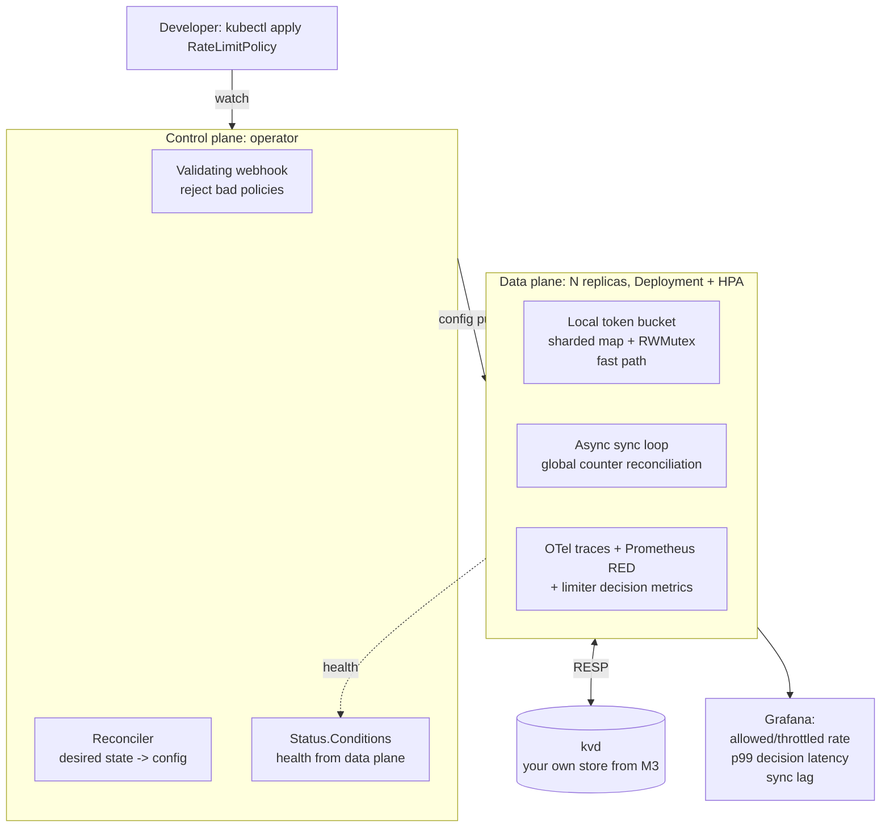

A dated campaign plan: Go + Kubernetes + distributed systems, aimed at a platform/infrastructure
role at Swiggy, Agoda, or Booking.com.

**Written:** 2026-08-14 · **Target:** offer signed by 2027-02-14 · **Budget:** 10–12 h/week (~270 h total)

> `ROADMAP.md` is the *syllabus* — what to learn, phase by phase, with the JS analogies. Keep it open
> as a syntax reference and lookup index. **This** document is the *campaign plan* — dated outcomes,
> what ships when, the interview loops, and the accountability that replaces 56 unticked checkboxes.
> They are complements. Don't delete either.

---

## §1 — Where you actually are

### The scoreboard

Measured from this repo on 2026-08-14, not estimated:

| Measured | Value |
|---|---|
| Days of hands-on Go | **3** (Aug 12, 13, 14) |
| Total Go lines | 488 across 13 files |
| Files that are `package main` | **13 / 13** |
| Distinct stdlib packages used | **4** (`fmt`, `time`, `sync`, `slices`) |
| Occurrences of `if err != nil` | **0** |
| `_test.go` files | **0** |
| Programs a stranger could run | **0** |
| `ROADMAP.md` checkboxes ticked | **0 / 56** |
| Commits that modified an existing file | **0 / 11** |

You planned on Aug 5, stalled seven days, then sprinted Aug 12–14. So it's 3 working days, not 10
calendar days. That distinction matters because 3 days of output this good is genuinely fast.

### What you actually got right — and it's not what it looks like

Read your own repo carefully and you'll find two different comment voices in it.

One voice is polished, cites exact Go version numbers, and reaches for JavaScript analogies in the
identical register as `ROADMAP.md`:

```go
// select blocks until ONE case is ready. Think Promise.race — except a
// Promise.race is one-shot, while this sits in a loop and keeps racing.
```
```go
// wg.Go (Go 1.25+) does Add(1), starts the goroutine, and calls Done
// for you. `i` is per-iteration since Go 1.22, so no shadow copy needed.
```
```go
// Box embeds Shape. Embedding = a type written with NO field name and NO comma.
```

That's scaffolding. It was generated for you — same author as `ROADMAP.md`. It covers
`exercises/functions/main.go`, all four `exercises/goroutines/*.go`, `exercises/Struct/composition.go`,
and `exercises/interface/main.go`.

The other voice has typos, is informal, and reaches for things you already know:

```go
// will be dificult for the garbage collector because it uses heap,
// not from the DSA it's different here
```
```go
// only we can read the values ,
// we can't edit it since the copy of the variable is passed
// In order to edit the params or arguements passed , we must send the Pointer* of it
```

That's you. And `exercises/slices/main.go` — six different loop forms including
`for v := range slices.Values(items)`, no comments at all, `"Mosi Mosi"` and `"Gambare"` as the test
data — is also you.

**So here's the honest credit assignment.** What you derived yourself: pointer semantics, value-vs-pointer
parameters proven by printing addresses, receivers, slice iteration including the modern
range-over-func form, and — the standout — reaching for **stack-vs-heap escape behavior unprompted** in
`pointersV2`, returning `&localVar` and printing `%p` from both sides of the return to prove the address
survived. Nobody asked you to do that on day three. It's the single best signal in the repo about how
you learn, and it's the reason a 6-month target isn't delusional.

What you *read* but do not yet *own*: `select` with `time.After` and `default`, buffered-vs-unbuffered
rendezvous semantics, `wg.Go`, WaitGroup copy rules, struct embedding promotion. Those insights were
handed to you. You can recognize them; you have not yet had to produce them from a blank file, and
you have never debugged one.

**This matters practically.** An interviewer will not ask "what does `select` do?" They'll say "walk me
through a goroutine leak you found." The seam between recognized and owned shows up in about 90 seconds
under that kind of question. Every concurrency item in this plan is therefore structured as *build it
from empty, then break it, then instrument it* — never as *read about it*.

### The honest other half

488 lines that print things to prove a language feature exists. Zero lines that do a job for a user.

`if err != nil` appears **nowhere** in this repo. No `defer` in any executing code path. No `map`
constructed anywhere. No `switch`. No type assertion, no type switch. No `context`. No `Mutex`, no
`atomic`, no `errgroup`, no worker pool. No test. No `net/http`. No JSON. No file I/O, no `os.Args`,
no `flag`. No package that isn't `main`, so no exported/unexported design, no import boundary, no
`cmd/`, no `internal/`. No Makefile, Dockerfile, CI, `.gitignore`, or README.

That list is roughly 100% of what gets probed in the first 40 minutes of any Go interview.

**Reframe:** you are not 3 days from beginner. You are 3 days into an aggressive start with a badly
lopsided inventory — you did the *hard* half first and skipped the *boring* half, and the boring half
is the part that's load-bearing. This plan is a rebalance, not a restart.

### The risk that will actually sink this

Not motivation. You shipped 177 lines of concurrency in one sitting. The risk is structural, and it's
written plainly in your git history:

- **11 commits. Every single one purely additive.** You have never modified a file after creating it.
- **Every commit creates a new folder.** `hello-world`, `conditions`, `slices`, `Struct`, `interface`,
  `goroutines`, `pointers`, `pointersV2`.
- **`pointersV2` is the tell.** When the pointers exercise wasn't satisfying, the instinct was to
  create a new folder rather than extend the old one.
- **`exercises/functions/main.go` is committed broken.** `sum()` returns 0. `counter()` returns 0.
  `fizzBuzz()` is empty. `wordCount()` returns nil. `main` prints `// expect 1 2 3` and actually
  outputs `0 0 0`. That file has never been reopened.
- **0/56 checkboxes**, in a plan whose own instructions said "check boxes off as you go and commit —
  that's your actual journey log."

The pattern has a name: **breadth collection with no re-entry.** Extrapolate it six months forward and
February 2027 looks like this — ~60 exercise folders, ~2,500 lines, passing familiarity with every Go
feature, zero tests, zero deployed artifacts, and nothing you can talk about for 45 minutes. That is
by far the most likely way this fails.

Nothing in your current setup ever *forces* you to go back. So:

> ### The three anti-drift rules
>
> **1. No new `exercises/` folder after Aug 31, 2026. Ever.**
> New learning lands as a test or a feature inside a service that already exists. Want to understand
> `sync.Pool`? You add a benchmark to code you already wrote.
>
> **2. One module, four long-lived services, each consuming the previous one.**
> `tq` → `linkd` → `kvd` → hero data plane. The dependency is real, not decorative. You cannot
> progress without editing old code.
>
> **3. Nothing is "done" until it passes all seven gates in §7.**
> A committed `sum()` that returns 0 fails gate 2.

**Your first task, today, 30 minutes:** fix the four TODOs in `exercises/functions/main.go`. Make
`divide` return a real error when `b == 0` instead of panicking. Make the closure actually count.
Make `wordCount` return a real map. This is worth doing not for the Go content but because it
establishes re-entry as a normal thing you do on day one of the plan.

---

## §2 — Calendar reality check

Read this before the month plan, because it changes the shape of everything and you will want to
argue with it.

Interview loop durations, end to end:

| Company | Stages | Elapsed |
|---|---|---|
| Agoda | 5–7 | 4–8 weeks |
| Booking.com | 3–4 main rounds | 4–6 weeks |
| Swiggy | 4 | 3–5 weeks + notice period |

An offer signed by mid-February 2027 therefore requires **applications out by November 15, 2026** —
and for Agoda's longer funnel, closer to November 1.

> **You do not have 6 months to build and then interview. You have 13 weeks to build
> (Aug 14 → Nov 15), and then you are interviewing *while* you finish.** The hero project ships in
> the middle of your loops, not before them.

```
              Aug    Sep    Oct    Nov    Dec    Jan    Feb
BUILD      ████████████████████████████░░░░░░░░░░░░░░░░
DSA (Go)   ──────░░░░████████████████████████████████░░
SYS DESIGN ────────────────────░░░░████████████████░░░░
APPLY                            ▲Nov 15 ████████████
LOOPS                                    ████████████████
BLOG / OSS                       ────────░░░░████████████
```

### Target order, by probability

1. **Swiggy — highest probability, apply first.** India-based, Go-native stack, and their loop
   explicitly mandates Go for the coding rounds. Your Go work counts directly. Caveat in §5: this
   also makes it a DSA gate.
2. **Agoda India (Gurgaon / Bangalore) — second.** Actively hiring backend, and their infrastructure
   org is genuinely doing the kind of platform work you want. See §4 for why that shapes the hero project.
3. **Booking.com — stretch, apply anyway.** Amsterdam-based, needs relocation and visa sponsorship.
   They do sponsor, but for a 1–3 YoE candidate also switching primary language, this is the hardest
   of the three. Note that Agoda is part of Booking Holdings, so an Agoda India role is a plausible
   internal path to Booking later.

**Fourth tier — practice reps, and genuinely good jobs.** Apply here too, deliberately, earlier, to
burn your first-loop mistakes on companies that aren't your top choice: Razorpay, Zerodha, PhonePe,
Dream11, Uber India, Rippling, Hasura, InMobi, Media.net. Target ≥12 applications total by Nov 15.

---

## §3 — Month by month

Every month interleaves all four tracks — Go depth, distributed systems, Kubernetes, interview prep.
K8s starts in week 1, not month 4. There is no version of this where you do three months of Go and
then three months of Kubernetes and arrive interview-ready.

**Budget:** ~45 h/month, 10–12 h/week, ~270 h total. Allocation:

| Track | Share | Hours |
|---|---|---|
| Go depth (language, testing, perf) | 35% | ~95 |
| Hero project | 25% | ~68 |
| DSA in Go | 15% | ~40 |
| System design | 10% | ~27 |
| Kubernetes fundamentals | 10% | ~27 |
| Applications, mocks, writing | 5% | ~13 |

When you want to add something, this table tells you what it costs.

---

### Month 1 — Aug 14 → Sep 13
**Theme: the boring half, and your first actual program.**

**Ship: `tq` — a task CLI.** Not the drill version. A real module:

```
cmd/tq/main.go              # flag parsing, subcommand dispatch, exit codes
internal/task/task.go       # domain type, validation, sentinel errors
internal/task/task_test.go
internal/store/json.go      # persistence, atomic write-rename
internal/store/json_test.go
Makefile  .golangci.yml  .gitignore  Dockerfile  README.md
.github/workflows/ci.yml
```

Every gap from §1 gets closed by this one program, deliberately:

- **Errors** — `var ErrNotFound = errors.New("task not found")` as a sentinel; wrap with
  `fmt.Errorf("load %s: %w", path, err)`; check with `errors.Is`; one custom error type
  (`*ValidationError` with a `Field` string) checked with `errors.As`. This is the single most
  important thing in Month 1. Every function that can fail returns `error` as its last value, and
  every caller checks it.
- **`defer`** — file close, and understand *why* `defer f.Close()` on a write handle without checking
  the error is a bug.
- **Maps** — index tasks by ID.
- **`switch`** — subcommand dispatch. One type switch in your error-rendering path.
- **Packages** — `internal/` is unreachable from outside the module. Exported vs unexported is now a
  real design decision, not a capitalization rule.
- **Atomic write-rename** — write to `tasks.json.tmp`, `f.Sync()`, then `os.Rename`. Rename is atomic
  on POSIX; a naive `os.WriteFile` truncates and can lose everything on a crash mid-write. This is
  your first taste of durability thinking and it will come back in Month 3.
- **Tests** — table-driven with `t.Run` subtests, on every `internal/` package. `go test ./... -race`.

**Kubernetes (~8 h).** Install `kind`. Stand up a cluster. Learn `kubectl` for real —
`get`, `describe`, `logs`, `exec`, `port-forward`, `-o yaml`. Hand-write Pod, Deployment, Service,
and ConfigMap YAML from scratch (do not copy-paste; type them). Then containerize `tq` with a
multi-stage distroless Dockerfile and run it as a `Job` in kind.

Deliberate choice: your first contact with Kubernetes deploys **your own binary**, not a tutorial
nginx. It sticks about ten times better.

**Interview (~4 h).** LeetCode in Go, 4/week, arrays + strings + hashmaps only. The point this month
is not algorithms — it's making `slices`, `maps`, `strings.Builder`, and byte-vs-rune handling
automatic so they cost you nothing later.

**Done means:**
- A stranger runs `go install github.com/Priyadharshan0903/Golang-Journey/cmd/tq@latest` and it works.
- CI badge green on `main`.
- `exercises/functions/main.go` TODOs completed.
- `go test ./... -race -cover` shows >70% on `internal/`.
- `tq` runs as a Job in kind and you can read its logs with `kubectl logs`.

---

### Month 2 — Sep 14 → Oct 13
**Theme: a service, in a container, in a cluster, with metrics.**

**Ship: `linkd`** — a link-shortener HTTP service. This merges old Projects 2 and 3 from
`ROADMAP.md`; there's no reason to build an in-memory version and then throw it away.

- **Stdlib `net/http` only.** No gin, no chi, no echo. Go 1.22+ routing patterns give you
  `mux.HandleFunc("GET /links/{id}", ...)` with method matching and wildcards, which is enough.
  This is deliberate: interviewers ask what the framework is doing for you, and you need to be able
  to answer. You can adopt chi later from a position of knowing why.
- **`context.Context` as the first parameter** of every function that touches I/O. All the way down
  to the DB call. This is the habit that most JS devs never form and it's non-negotiable for platform work.
- **`log/slog`** structured logging, with a request-scoped logger carrying a request ID.
- **Middleware chain** built from `func(http.Handler) http.Handler` closures: request ID → logging →
  panic recovery → timeout. Write the chaining helper yourself.
- **Postgres via `pgx/v5`**, migrations via `golang-migrate`. Understand what `database/sql`'s
  interfaces are and why `pgx` offers both a stdlib-compatible and a native mode.
- **Graceful shutdown** — catch SIGTERM, `server.Shutdown(ctx)` with a drain timeout, stop accepting
  new connections while finishing in-flight ones. This is exactly what Kubernetes does to your pod
  on a rolling update, so it's the bridge between the two tracks.
- **Tests** — `httptest` for handlers, `testcontainers-go` for integration tests against a real
  Postgres in CI. Not a mock. A real database in a container.
- **Metrics** — `promhttp` on `/metrics`, RED metrics (Rate, Errors, Duration) with a latency
  histogram. Plus `/healthz` (am I alive) and `/readyz` (can I serve traffic — checks the DB).

**Concurrency, for real this time (~10 h).** This is where Month-1-you stops being a reader:

- A **bounded worker pool** doing async link-preview fetches. Semaphore channel
  (`sem := make(chan struct{}, n)`), not unbounded goroutine spawn.
- **`errgroup.WithContext`** for fan-out — first error cancels the rest. Contrast it with
  `sync.WaitGroup` and be able to say why you picked which.
- **Directional channel types** in your internal APIs — `<-chan Result` for a producer's return,
  `chan<- Job` for a consumer's input. Let the compiler enforce direction.
- **A deliberate goroutine-leak test** with `go.uber.org/goleak`. Write a leak on purpose (blocked
  send with no receiver; a worker that ignores `ctx.Done()`), watch `goleak` catch it, then fix it.
  Then read `/debug/pprof/goroutine?debug=2` on the leaking version so you know what it looks like.

**Kubernetes (~12 h).** Full manifests for `linkd`: Deployment, Service, Ingress, ConfigMap, Secret.
`resources` requests and limits. Liveness, readiness, and startup probes wired to your *real*
`/healthz` and `/readyz`. A `HorizontalPodAutoscaler`. All of it behind `make deploy-kind` as one
command. Then install `kube-prometheus-stack`, scrape your service, and build one Grafana dashboard.
Watch a `kubectl rollout restart` happen and understand every step of it.

**Distributed (~6 h).** DDIA 2nd edition, Part I. Start reading `x/time/rate` source and understand
token bucket — this is a deliberate seed for the hero project.

**Interview.** LeetCode 5/week (add two-pointer, sliding window, binary search, `container/heap`).
Rewrite your resume once, using the framing in §5d.

**Done means:**
- `make deploy-kind` produces a pod serving real traffic.
- Grafana dashboard showing p99 latency and error rate from your own metrics.
- `goleak` in CI, passing — after you've seen it fail.
- Integration tests running in CI against a real Postgres.
- `kubectl rollout restart` under load drops **zero** requests. Prove it with a load generator.

---

### Month 3 — Oct 14 → Nov 13
**Theme: distributed systems you built, not distributed systems you read about.**

**Ship: `kvd`** — a key-value store speaking **RESP**, the Redis wire protocol, over raw `net`.

The RESP choice is the important one. It means `redis-cli` connects to your server, and — more
importantly — your hero project's data plane can point at `kvd` as its shared counter store in
Month 4. This is what turns Project 5 from a throwaway toy into infrastructure you own end to end.

- Raw `net.Listener`, one goroutine per connection, read/write deadlines so a dead client can't
  pin a goroutine forever.
- RESP parser, **fuzz-tested** (`go test -fuzz`). Protocol parsers are where fuzzing pays for itself
  immediately, and it's a strong thing to have on a resume.
- Persistence: append-only log plus periodic snapshot. Now the atomic write-rename from Month 1 matters.
- TTL expiry.
- Concurrency: start with `sync.RWMutex` around one map. Then **benchmark it** against `sync.Map` and
  against a sharded map (N maps, key hashed to a shard). Write the numbers in the README. The point
  is not to win — it's that you can say "I measured it, here's the crossover point."

**Then: replication.** Add leader/follower replication with `hashicorp/raft`. Separately, read
`etcd/raft`'s design to see a different set of tradeoffs.

And the highest-leverage item in this entire plan: **MIT 6.5840 (formerly 6.824), Lab 2 (Raft)**.
The labs are written in Go, the lectures and paper list are public, and there is no faster way to
convert "I read about consensus" into "I have debugged a leader election at 2am." Do Lab 1 (MapReduce)
as a warm-up if you have room, but Lab 2 is the one that matters.

**Go depth — first real performance month.**
- `go test -bench` + `benchstat` for statistically honest before/after comparisons.
- `pprof` CPU and heap profiles on `kvd` under load. Read an actual flame graph.
- The execution tracer (`go test -trace`) — see goroutines blocking.
- `go build -gcflags="-m"` to make your `pointersV2` escape-analysis instinct **rigorous**. You
  guessed correctly on day three; now prove it from the compiler's own output. Also correct the
  framing: escape analysis moving a value to the heap is routine and cheap, not "difficult for the
  garbage collector."
- `sync.Pool` for connection buffers, with a benchmark that *proves* it helped — and note the case
  where it hurts.
- `GOGC` and `GOMEMLIMIT`, and why `GOMEMLIMIT` specifically matters when your process has a cgroup
  memory limit.

**Kubernetes (~10 h) — go inside.** `client-go`: clientsets, informers, the shared informer cache,
work queues. Read `kubernetes/sample-controller` end to end **before** you touch controller-runtime,
so you know what the framework hides. Understand the reconcile loop, level-triggered vs edge-triggered
(and why Kubernetes is level-triggered), resource versions, and optimistic concurrency on update
conflicts. This is the prerequisite for Month 4 — don't skip it.

**Distributed.** DDIA 2e Parts II–III: replication, partitioning, transactions, consensus. The Raft
paper. Aphyr's consistency models page.

**Interview.** System design starts: 1 problem/week, **written up**, not just thought about.
LeetCode 5/week (graphs, trees, intervals). **Book and pay for your first mock interview** in week 3.

**Done means:**
- Three-node `kvd` cluster in kind. Kill the leader. A new one is elected. Writes continue. You have
  a terminal recording of this.
- Benchmarks committed with before/after numbers in the README.
- You can explain, unprompted, which network partition causes your store to lose data and what it
  would cost to fix.

---

### Month 4 — Nov 15 → Dec 13
**Theme: hero project phase 1, and applications go out.**

**Ship: `flowguard` phase 1** — CRD + operator reconciling to a working data plane in kind. Full spec
in §4.

**Applications go out November 15 — before the hero project is finished.** This is not negotiable and
it will feel wrong. Ship the README with an explicit `## Status: in progress` section listing what
works and what's next. Platform interviewers respect a documented in-flight distributed system far
more than a polished CRUD app; "here's what I'm building and here's the part I haven't solved yet" is
a *senior* conversation opener. Waiting for done means applying in January and getting an offer in March.

Target: **≥12 applications** across the three target companies and the practice tier.

**Interview — ramp hard.** LeetCode 5/week. Two system design problems/week. Two paid mocks this
month. Start writing and rehearsing the §5d narrative *out loud*, not in your head.

**Done means:**
- ≥12 applications submitted.
- `kubectl apply -f policy.yaml` causes observable behavior change in a running data plane.
- `Status.Conditions` on your CRD reflects real health, not a hardcoded value.

---

### Month 5 — Dec 14 → Jan 13
**Theme: hero project phase 2, observability, and interview loops.**

**Ship: `flowguard` phase 2** — distributed correctness (the multi-replica global limit),
OpenTelemetry traces and metrics, a load test with `k6` or `vegeta` and a documented
throughput/latency table, a Grafana dashboard, a chaos test (kill a data-plane pod mid-load and show
the SLO held), and a **6-minute recorded demo video** linked from the README.

**Two zero weeks are scheduled: Dec 22 – Jan 4.** Not "if I need a break." Scheduled. Your Aug 5–12
gap was followed by guilt; a *planned* gap can't be. Build it into the calendar so the calendar
survives contact with reality.

**Interview — this is loop season.** Rounds are happening. Post-mortem every single round in `LOG.md`
within 24 hours, while you still remember the question you fumbled.

**Done means:**
- Demo video exists and is linked from the README.
- Load test numbers in the README, including the multi-replica global-limit result.
- ≥4 loops in progress or completed.

---

### Month 6 — Jan 14 → Feb 14
**Theme: closing.**

**Ship: nothing new.** The temptation to start something will be strong. Don't.

- Polish what exists. READMEs, demo, honest-limitations sections.
- **Two technical blog posts.** One on the operator. One on a concurrency bug you actually found with
  `-race` or `goleak`, with the stack trace and the fix. The second one is the most credible thing you
  can possibly write, because nobody fakes a race-detector output.
- **3–5 merged PRs** to CNCF Go projects (targets in §5d).
- Onsites, negotiation, and a second round of applications informed by what the first round's
  rejections taught you.

**Done means:** an offer — or a written diagnosis of exactly which round is failing, and a 6-week fix
aimed at that round specifically.

---

### What to cut from the existing 7-project ladder

`ROADMAP.md` lists seven projects. Seven is too many for 13 weeks, and two of them actively cost you.

| # | Project | Verdict |
|---|---|---|
| 1 | CLI task tracker | **KEEP** — compressed to 3 weeks, upgraded to multi-package + tested + CI + containerized |
| 2 | URL shortener (in-memory) | **MERGE into #3** — no reason to build it and throw it away |
| 3 | REST API + real DB | **KEEP** as the merged `linkd` |
| 4 | Concurrent web scraper | **CUT as standalone.** Its entire lesson — worker pool, rate limiting, error aggregation across goroutines — is absorbed into `linkd`'s async fetcher and the hero data plane. It's also the single most common project on every junior Go resume, so it differentiates you from nobody |
| 5 | Mini KV store over TCP | **KEEP, with two changes:** RESP-compatible so the hero project consumes it, and add Raft. Goes from toy to distributed-systems centerpiece |
| 6 | `bubbletea` TUI dashboard | **CUT ENTIRELY.** Zero platform signal. Worse, it's a comfort trap: it's UI reasoning you already have from JS, so it *feels* productive while teaching you nothing an infra interviewer asks about. If you want a UI for your platform, `kubectl` is your UI |
| 7 | LLM + MCP orchestration panel | **DEMOTE from capstone to a 2-day artifact.** Reasons below |

**On the MCP panel specifically**, since it was your capstone and cutting it stings:

1. For a *platform team* loop it reads as "LLM application developer," which is a different job with
   a different interview.
2. By early 2027 it's among the most saturated project categories in existence. It differentiates you
   from nobody.
3. Most importantly: an interviewer **cannot probe distributed systems, consensus, or Kubernetes
   internals through it.** It burns your best 45 minutes on the wrong topics. That's the real cost.

**But don't throw the idea away — reframe it.** Once `flowguard`'s operator exists, spend two days
writing an MCP server that exposes *your operator's CRDs* as tools, so an LLM can read and propose
rate-limit policies. Now it's a 200-line demonstration that your platform is extensible, it name-drops
correctly for anyone who cares about that, and it costs you two days instead of eight weeks.

**Net: 7 projects → 4**, each consuming the previous one.

---

## §4 — The hero project

### `flowguard` — a Kubernetes-native distributed rate-limiting platform

Two components, one repo: a **control plane** (Kubernetes operator) and a **data plane** (the thing
that actually enforces limits).

**Control plane.** A kubebuilder / `controller-runtime` operator owning a `RateLimitPolicy` CRD:

```yaml
apiVersion: flow.priyadharshan.dev/v1alpha1
kind: RateLimitPolicy
metadata:
  name: search-api
spec:
  target:
    service: search
    path: /api/search
  limit:
    requests: 100
    per: 1s
  key: header:X-API-Key
```

With: a `Status` subresource carrying real `Conditions` (not hardcoded), Kubernetes Events on
reconcile outcomes, finalizers for clean teardown, and a **validating admission webhook** that
rejects nonsense policies before they're persisted.

**Data plane.** A Go HTTP proxy enforcing a distributed sliding-window / token-bucket limit:
a **local in-process bucket** for the fast path (sharded map + `RWMutex`, the thing you benchmarked in
Month 3), plus an **async reconciliation loop** against shared state in your own `kvd`. This is where
the hard engineering lives — the local/global accuracy tradeoff is the whole problem.

### Why this project, over the alternatives

I considered four and this one wins clearly:

- **A Kubernetes operator alone** shows K8s, but the Go is glue code. An interviewer can't probe your
  concurrency or performance work through a reconciler, so you'd fail "walk me through the hardest bug
  you've fixed."
- **A distributed rate limiter alone** is a great Go and distributed-systems artifact, but generates
  zero Kubernetes signal — and you explicitly want platform *plus* Kubernetes.
- **A service mesh sidecar** is too large for 13 weeks, and in 2026 it's strategically dated: the
  ecosystem has moved toward sidecar-less designs (Istio ambient mode, Cilium service mesh) with eBPF
  dataplanes at scale. Building a sidecar proxy now invites "why didn't you do this with eBPF?" — a
  question you don't want to be answering.
- **An observability pipeline** is mostly OpenTelemetry Collector configuration plus a little Go. Hard
  to show any delta over off-the-shelf.

**The control-plane + data-plane pair is the actual shape of platform work at all three target
companies.** Agoda's infrastructure org builds an orchestration platform on top of Kubernetes across
roughly 20 clusters and ~150k cores, with Go infra tooling. Booking runs a multi-region marketplace
where rate limiting and availability are first-order concerns. Swiggy is Go-native and their design
round is explicitly about scalable Go backends with real concurrency reasoning. This project lets you
answer "what have you built" with something *structurally identical* to what the team does daily.

There's a second reason: rate limiting is the richest distributed-systems conversation you can start
from a small codebase. It naturally contains CAP tradeoffs, clock skew, hot keys, the local-vs-global
accuracy tradeoff, and measurement problems like coordinated omission. A 2,000-line project that opens
five deep conversations beats a 10,000-line project that opens one.

### Architecture



### The 6-minute demo, step by step

Portfolio projects die at "what do I actually show." So this is scripted. Rehearse it, then record it.

1. **`kubectl apply`** a policy: 100 req/s on `/api/search`. Show `Status.Conditions` flipping to `Ready`.
2. **Load test at 500 rps.** Grafana shows ~100 allowed, ~400 throttled, correct `429`s with a
   `Retry-After` header.
3. **`kubectl scale` the data plane 1 → 5 replicas mid-load.** The global limit stays ~100, **not 500.**
   This is the money shot — it is the entire distributed-systems point of the project, and it's the
   moment an interviewer leans in. If you show one thing, show this.
4. **`kubectl delete pod`** on a data-plane replica under load. Zero dropped requests, SLO held.
   (This is your Month 2 graceful-shutdown work paying off.)
5. **Edit the policy to 50 rps.** Show propagation latency measured in Grafana.
6. **pprof flame graph + benchmark table.** "The fast path is X ns/op with 0 allocations after I pooled
   the buckets — here's the before and after from `benchstat`."

### Honest limitations — put this in the README

A section titled "Known limitations," covering: the accuracy window of the local/global reconciliation
(you *will* over-admit briefly after a scale-up), the clock assumptions the sliding window makes and
what skew breaks it, hot-key behavior when one API key dominates, and where this falls over at 10k
replicas.

Documented limitations are a seniority signal. Interviewers specifically look for whether you know the
edges of your own system, and most candidates present their project as if it has none.

---

## §5 — Interview track

### 5a. The three loops

Round counts blend official sources with candidate write-ups; treat them as indicative and confirm on
your first recruiter call (see §8).

**Swiggy** — best first target, clearest Go signal.

| # | Round | Notes |
|---|---|---|
| 1 | DSA online, ~70 min, 3 mediums | **In Go** — Swiggy mandates the language |
| 2 | Live DSA (Intervue), medium-hard | Expected to pass all test cases |
| 3 | System design in Go | e.g. "design Uber/Ola." Rewards modularity + explicit concurrency reasoning |
| 4 | Hiring manager | System design + LLD + resilience patterns + concurrency |

**The implication is blunt: Swiggy is a DSA-in-Go gate.** Rounds 3 and 4 are where your `flowguard`
and `kvd` work makes you look strong — but if your LeetCode-in-Go count is under ~120 you never reach
them. Don't let the fun part of the plan crowd out the grinding part.

**Agoda** — 5–7 stages, 4–8 weeks.

| # | Round | Notes |
|---|---|---|
| 1 | Recruiter screen | 15–30 min. Ask about language policy here (§8) |
| 2 | HackerRank OA, ~90 min | 2–3 problems, easy → hard |
| 3 | Live coding, 60 min | Code quality, edge cases, and *stated* reasoning are graded. A clean working solution beats an over-engineered broken one |
| 4 | System design, 60 min | Reported prompts: concert booking, flash sale, paginated CRUD REST API |
| 5 | Behavioral / managerial | |

**Booking.com** — 4–6 weeks, the stretch.

| # | Round | Notes |
|---|---|---|
| 1 | Recruiter | |
| 2 | Coding | 1–2 mediums, practically phrased rather than LeetCode-hard. Decomposition and clean code graded over cleverness |
| 3 | System design, 45–60 min | Marketplace-flavored: hotel search and availability, preventing double-booking, multi-region, currency. **They expect you to ask clarifying questions before designing** — traffic per second? consistency or availability? |
| 4 | Culture fit | Plus, for some roles, a domain/experimentation round (A/B methodology, metrics, sample size, stopping rules) |

### 5b. DSA: how much, and in what

**Yes, LeetCode. And do it in Go, not JavaScript.**

Target **130–160 problems** by February. Blind 75 first, then fill toward NeetCode 150. At 5/week from
mid-August that's ~130 — enough for Booking and Agoda, borderline for Swiggy's harder round 2, so
front-load if Swiggy is your first choice.

Writing them in Go is the point. You get algorithm practice and Go fluency from the same hour, and
you avoid the specific failure mode of solving it fine in JS and then fumbling the Go syntax in a
round that mandates Go.

**Go traps that lose a round a JS dev should win:**

- **`append` aliasing in backtracking.** The classic: every result slice shares a backing array and
  you get N copies of the same answer. Fix: `res = append(res, append([]int(nil), path...))`.
  This bug has failed more interviews than any other Go gotcha.
- **`container/heap` boilerplate.** There is no `PriorityQueue`. You implement five methods. Write it
  once, memorize it, and stop losing 8 minutes to it.
- **`slices.SortFunc` / `sort.Slice`** and the comparator sign convention (negative = less).
- **`strings.Builder`**, never `s += x` in a loop.
- **`byte` vs `rune`.** `for i, r := range s` advances `i` by *bytes* while `r` is a rune. `len(s)` is
  bytes. `s[i]` is a byte. This bites on every string problem with non-ASCII input.
- **No ternary, no default args, no `.map()`/`.filter()`.** Write the loop and stop resenting it.
- **Integer division truncates** toward zero. There's no `Math.floor` habit to lean on, and negative
  numbers behave differently from Python.
- **Map iteration order is randomized deliberately.** A solution that passes locally can fail on the
  judge if you accidentally depend on order.

### 5c. Go questions that actually come up

**Tier 1 — must be perfect.** These are table stakes; getting one wrong reads as "hasn't written Go."

- Buffered vs unbuffered channel semantics. What happens on: send to a closed channel (panic), receive
  from a closed channel (zero value, `ok == false`), closing twice (panic), a nil channel in a `select`
  (that case is never ready — which is the idiom for disabling a case).
- Why a deadlock is a **runtime fatal error, not a panic**, and therefore `recover()` cannot catch it.
  You already know this one from your `channels.go` reading — say it in an interview, it lands well.
- `defer` evaluation: LIFO order, and **arguments are evaluated at defer time**, not at run time.
  The classic `defer fmt.Println(i)` in a loop question.
- Slice vs array. What `append` does when `cap` is exceeded, and why two slices can share a backing array.
- Value vs pointer receivers, and the method-set consequence (a `*T` method is not in `T`'s method set).
- **Why an interface holding a nil pointer is not `nil`.** The `(*MyError)(nil)` returned as `error`
  bug. This is asked constantly.
- `context` cancellation propagation, and why `context.Value` should not carry business data.

**Tier 2 — the platform-role differentiators.** These are what separate you from every other candidate
who did a tutorial.

- **Goroutine leaks:** the three causes (blocked send with no receiver, missing `ctx.Done()` handling,
  unbounded goroutine spawn) and how you *detect* them — `goleak` in tests, the pprof goroutine
  profile, `/debug/pprof/goroutine?debug=2` in prod. You'll have done all three in Month 2.
- The **GMP scheduler**: G, M, P; work stealing; what makes a goroutine yield; why a tight CPU loop
  with no function calls used to block preemption.
- **Escape analysis** — and specifically how you *prove* a variable escaped (`-gcflags="-m"`), not
  just that you believe it did.
- `sync.Pool`: what it's for, and the case where it makes things worse.
- **Mutex vs channel** selection criteria. "Channels for passing ownership, mutexes for protecting
  state" is the short answer; be able to give an example of each.
- What `-race` can and **cannot** see (it only detects races on code paths that actually execute).
- `errgroup` vs `WaitGroup` — error propagation and context cancellation.
- Bounded concurrency via a semaphore channel, and why unbounded `go func()` in a request handler is
  a production incident waiting to happen.

**Tier 3 — currency signals.** Cheap to mention, disproportionately effective, because they show you
track the language rather than having learned it once.

- **Go 1.26** (Feb 2026) made the **Green Tea GC the default**, cut cgo call overhead substantially,
  allows `new(expr)`, and permits self-referential generic type parameters.
- **`GOMEMLIMIT`** as a soft memory limit, and why it specifically matters for a Go process inside a
  container with a cgroup limit — without it, the GC doesn't know about the limit and you get OOMKilled.

### 5d. The credibility gap

Your day job is JavaScript at Workday. "Tell me about your infrastructure experience" is the round most
likely to sink this, and it's fixable without changing jobs. Four moves.

**Move 1 — mine the job you already have.** Almost nobody at a company like Workday writes purely
React. Go find and *quantify*: the CI pipeline your team owns, build or bundle times you improved, a
feature-flag rollout you ran, any on-call rotation or incident you touched, the monorepo tooling, the
deploy process, the Kubernetes manifests your service already deploys with, any p95 latency or bundle
size you moved.

Frontend performance work is **genuinely systems work** — measure, profile, find the bottleneck, prove
the fix. That is precisely the loop you'll run with pprof in Month 3, and it should be framed as the
same skill, because it is. And Workday is large-scale enterprise SaaS, which means the scale words in
your stories are real, not inflated.

**Move 2 — reframe the pivot as continuity, not escape.** The bad answer is "I want to move away from
frontend." It reads as running from something. The good answer names a specific problem that pushed you
down the stack:

> "At Workday I own [X] in the [Y] product. What pulled me toward infrastructure was [specific concrete
> problem — an incident, a latency budget, a deploy that kept breaking]. I could see the symptom from
> the client but I couldn't fix it there — the fix lived in [the service / the deploy pipeline / the
> cluster]. So I started learning Go and Kubernetes properly, and rather than doing tutorials I built
> `flowguard`, a control plane and data plane for distributed rate limiting. Here's the part that
> surprised me: [specific bug, with numbers]."

Fill in the brackets with real specifics and rehearse it out loud. The last sentence is the one that
makes it a conversation instead of a pitch.

**Also have an answer for your repo history**, because a good interviewer who looks at your GitHub will
ask: *"I started in August 2026 with syntax drills. About three weeks in I realized I was collecting
language features instead of building systems, so I restructured around four services where each one
consumes the previous one."* Owning the pivot is a strength, not an admission.

**Move 3 — third-party proof.** Nobody has to trust your self-assessment if strangers have merged your
code. Target **3–5 merged PRs in CNCF Go repos by January.** Realistic entry points, roughly in
increasing difficulty: `kubebuilder` (its docs and testdata are genuine on-ramps into the codebase),
`kind`, `external-dns`, `prometheus/client_golang`, `open-telemetry/opentelemetry-go-contrib`,
`cilium/hubble`. Start with `good first issue` / `help wanted`.

Also **take the CKA.** Opinionated call: yes, mostly as a résumé filter-passer, and because the
hands-on exam format forces real `kubectl` fluency you can't fake. Skip KCNA (too introductory) and
skip CKAD (redundant with what you'll have built).

**Move 4 — try the internal transfer.** A move to a platform or infrastructure team *inside Workday*
is the single fastest way to convert "learning Go" into "shipped Go in production," and it doesn't
conflict with any of this. Even a conversation that goes nowhere gives you the vocabulary, the internal
context, and possibly a project you can talk about.

### 5e. System design topics, ranked by expected value

These loops are travel-marketplace and food-delivery flavored, not generic FAANG. Prepare accordingly:

1. **Rate limiting at multiple layers** — you will have *built* this. Find a way to bring it into
   every round.
2. **Inventory / availability without double-booking** — Agoda concert booking, Booking hotel
   availability, Swiggy order assignment are the same problem three ways: pessimistic locking,
   optimistic concurrency, idempotency keys, sagas.
3. **Flash sale / thundering herd** — an explicitly reported Agoda prompt.
4. **Search + availability caching** — cache invalidation, multi-region read replicas, currency and i18n.
5. **Geospatial dispatch** — Swiggy rider assignment: geohash / quadtree / S2, matching algorithms.
6. **Idempotency and exactly-once-ish delivery** in order and payment flows.
7. **Kafka event pipelines** and consumer-group rebalancing.
8. **Multi-region active-active** and which consistency you're choosing to give up.
9. **Observability and SLO design for the system you just designed.** Almost nobody volunteers this,
   and for a *platform* role it is the strongest closing move available to you. "Here's how I'd know
   this system is broken before a customer tells me" ends an interview well.

---

## §6 — Resources

Everything below is **additive to `ROADMAP.md`**, which already covers the Tour, Go by Example,
pkg.go.dev, Effective Go, Bodner's *Learning Go*, Cox-Buday's *Concurrency in Go*, Edwards' *Let's Go*,
*100 Go Mistakes*, gophercises, Boot.dev, and Exercism. Those are good. Don't re-buy them.

Each item is tagged with the month you need it, so this is a schedule, not a bibliography.

### Go depth and testing — M1–M2

- **Learn Go with Tests** (Chris James, free online) — **start here, week 1.** It teaches the language
  *through* tests, which is the single most targeted fix for "zero `_test.go` files in the repo."
- **Practical Go** and **SOLID Go Design** (Dave Cheney, free written workshops) — the best short
  writing anywhere on Go API design and package boundaries. This is the direct fix for
  `package main` × 13.
- **Uber Go Style Guide** (`github.com/uber-go/guide`) and the **Go Code Review Comments** wiki page —
  read both once, then use them as your self-review checklist on every PR (§7, mechanism 1).
- **Ardan Labs Ultimate Go** (Bill Kennedy) — the notes repo is free. The mechanical-sympathy and
  value-semantics material is unusually good and pairs directly with the escape-analysis instinct you
  already showed in `pointersV2`.
- **Let's Go Further** (Alex Edwards) — the sequel to the one already in your roadmap. JSON APIs, auth,
  rate limiting, graceful shutdown. Maps onto Month 2 almost line for line.

### Go performance — M3, M5

- **Efficient Go** (Bartłomiej Płotka, O'Reilly) — written by a Prometheus/Thanos maintainer.
  Benchmarking discipline, `benchstat`, profiling, and how not to lie to yourself with numbers.
- **go-perfbook** (Damian Gryski, free repo) — dense, practical optimization checklist.
- **Go Optimizations 101** (Tapir Liu) — short, allocation-focused.
- Talks: Rob Pike's **Concurrency is not Parallelism**, and **Bryan Mills, "Rethinking Classical
  Concurrency Patterns"** (GopherCon). The Mills talk is the best thing on when *not* to reach for a
  pattern, and it will meaningfully upgrade the concurrency code you already have.

### Distributed systems — M2–M4

- **Designing Data-Intensive Applications, 2nd edition** (Kleppmann & Riccomini, 2026). Get **2e**
  specifically — it was substantially revised for cloud-native data architectures. This is the spine
  of your distributed track.
- **MIT 6.5840** (formerly 6.824) — lectures, labs, and paper list all public, and **the labs are in
  Go.** Do Lab 1 (MapReduce) and Lab 2 (Raft) at minimum. **The highest-leverage single item in this
  entire plan** for the distributed-systems gap.
- **Distributed Services with Go** (Travis Jeffery, Pragmatic Bookshelf) — builds a distributed commit
  log with gRPC, Raft, service discovery, and Kubernetes deployment. Almost eerily aligned with
  Months 3–4.
- **Cloud Native Go, 2nd ed.** (Matthew Titmus) — resilience patterns (circuit breaker, retry with
  jitter, backpressure) in idiomatic Go; builds a distributed KV store.
- The **Raft paper**, plus `raft.github.io`'s visualization, plus Ongaro's thesis for the hard parts.
- **Aphyr's consistency models** page — the map you'll return to constantly.
- **Marc Brooker's blog** (AWS) — short, sharp writing on distributed systems as they actually behave.
- Read as source, don't just import: `hashicorp/raft` and `etcd/raft`.

### Kubernetes and platform — M1–M4

- **Programming Kubernetes** (Hausenblas & Schimanski, O'Reilly) — the client-go / informer / CRD /
  custom-controller internals book. Non-optional for the hero project.
- **The Kubebuilder Book** (official) — and read the **Good Practices** page carefully: one controller
  per Kind, idempotent reconciliation, one operator owns a CRD, reconcile on desired state rather than
  on events.
- **`kubernetes/sample-controller`** — read it end to end *before* touching controller-runtime, so you
  know what the framework is hiding from you.
- **Kubernetes the Hard Way** (Kelsey Hightower) — do it once. You will never again be confused about
  what the control plane components are or how they talk.
- **Learning eBPF** (Liz Rice) — currency, not implementation. eBPF is the default dataplane assumption
  at scale and sidecar meshes are losing ground to Cilium service mesh and Istio ambient mode. You
  don't need to write eBPF; you need to hold an informed opinion when asked.
- Ecosystem awareness for interviews: know what **Backstage**, **Helm**, and **kro** are and where each
  fits. Expect "how would you build a platform for AI workloads" as a live question — most platform
  teams now have AI assistants embedded in developer workflows and interviewers are probing it.

### Observability — M2, M5

- **Observability Engineering** (Majors, Fong-Jones, Miranda) — the vocabulary platform interviews
  assume: cardinality, SLO, error budget, high-dimensionality debugging.
- **Prometheus: Up & Running, 2nd ed.** (Brazil) — histograms, cardinality explosions, recording rules.
- **OpenTelemetry Go SDK** docs plus the Collector. Know the current shape of the ecosystem —
  Cilium/Hubble for network, Tetragon for security, OTel Collector for delivery, and eBPF-based
  auto-instrumentation for app tracing. Naming that split correctly is a cheap, real currency signal.

### System design and interview

- **DDIA 2e is your textbook. Alex Xu vol 1+2 is your flashcard deck.** Use Xu for pattern recall and
  interview format, not for understanding. Do not confuse having read Xu with knowing distributed
  systems — interviewers can tell instantly, because Xu-only answers have no failure modes in them.
- **system-design-primer** (donnemartin) for the checklist. **ByteByteGo** if you prefer video.
- **NeetCode 150**, solved in Go, tracked by count in `LOG.md`.
- **Paid mocks** — interviewing.io, Prepfully, or a MentorCruise mentor who does Go/K8s. **Book and pay
  in advance for specific dates.** The prepayment is the mechanism; the feedback is a bonus.

---

## §7 — Cadence and accountability

`ROADMAP.md` has 56 checkboxes and zero of them are ticked. But you wrote 488 lines of Go and got
through pointers, escape analysis, and receivers in three days.

**So the checkboxes didn't fail because you're undisciplined.** They failed because a checkbox is a
*permission slip*: it costs nothing to ignore and produces nothing when ticked. Nobody, including you,
can tell from the outside whether Day 23 happened.

**This plan has no checkboxes.** It has five mechanisms that produce artifacts instead.

### Mechanism 1 — The weekly merged PR

The unit of progress is **one PR merged into your own `main` with green CI.** Not a commit. A PR, on a
branch, with a description, that you self-review before merging.

Turn on branch protection so you *cannot* push to `main` directly. This forces you to read your own
code once before it lands — the exact habit missing from 11 straight additive commits. Fifty-two
chances between now and February to notice that something is bad.

### Mechanism 2 — `LOG.md`, append-only, five lines a week

Same four prompts, every week, dated:

```markdown
## 2026-08-22
- Shipped:
- Broke / what bit me:
- Couldn't explain:
- One thing next week:
```

**"Couldn't explain" is the important line.** It becomes your interview-prep queue, generated from real
friction instead of from a syllabus. When you sit down in Month 4 to prep Tier 2 questions, this file
already tells you which ones you're weak on.

And because it lives in git, your accountability artifact is your own commit graph — which you already
respond to, judging by the Aug 12–14 sprint.

### Mechanism 3 — Definition of Done, seven gates

Nothing counts as finished until all seven pass. This is the direct answer to `sum()` returning 0 in a
committed file:

1. Compiles. `go vet` clean. `golangci-lint` clean.
2. Has a test that would **fail if the code were wrong** — and no TODO stubs remain anywhere in it.
3. `go test ./... -race` green.
4. Doc comments on every exported identifier.
5. A README section a stranger could follow to run it.
6. Runs in kind (from Month 2 onward).
7. One sentence in `LOG.md` about what surprised you.

### Mechanism 4 — The five numbers

A table at the top of `LOG.md`, updated weekly. Only five, because a dashboard with twelve metrics is a
dashboard nobody updates:

| Week | PRs merged | Coverage on `internal/` | LeetCode-in-Go (cum.) | Mocks done | Applications out |
|---|---|---|---|---|---|
| 2026-W34 | | | | | |

Nothing about hours studied or topics covered. **Outputs only.**

### Mechanism 5 — Monthly gates, shrink-don't-slide

Each month has one demo-able artifact, defined in §3. At month end, record a **3-minute screen capture**
of it working — for yourself in Months 1–3, publicly from Month 4.

**If you miss a gate, the next month's scope shrinks. The calendar does not move.** February is fixed
because the interview loops are fixed and the Nov 15 application date is fixed. This is the specific
discipline a 56-day checklist structurally cannot enforce — a checklist just slides, silently, forever.

### The anti-drift rules, again

Repeated verbatim from §1 because they're the load-bearing part:

1. **No new `exercises/` folder after Aug 31, 2026.** New learning lands as a test or a feature inside
   an existing service.
2. **Every project consumes the previous one.** `tq` → `linkd` (reuses the store interface) → `kvd`
   (RESP) → `flowguard` data plane (uses `kvd` as its shared counter store). You physically cannot
   progress without editing old code.
3. **Nothing is done until it passes all seven gates.**

Plus one more: **every Friday, spend 30 minutes deleting or refactoring something you already wrote.**
Put it on the calendar. This is the direct counterweight to 11 additive commits, and it's the habit that
makes you employable — production engineering is mostly editing existing systems, not creating new ones.

### The stall protocol

The Aug 5–12 pattern will recur. Plan for it instead of feeling bad about it.

> **If three days pass with no commit, you do not owe yourself a catch-up sprint.**
>
> The rule is: **commit one failing test.** That's it. Five minutes.
>
> A failing test is a bookmark that tells future-you exactly where you were and what you were confused
> about, and it makes the next session start with momentum instead of re-orientation. Guilt-driven
> catch-up sprints are how a 7-day gap becomes a 5-week gap.

And note again: **two zero weeks are scheduled, Dec 22 – Jan 4.** A planned gap is part of the plan.

---

## §8 — Uncertainty log

Things in this document that you should verify rather than trust. A plan that hides its assumptions is
worse than one that flags them.

- **Whether Agoda permits Go** in its HackerRank OA and live coding round. Their product stack skews
  Scala / Kotlin / .NET; Go appears on the infrastructure side. The OA is usually language-of-choice on
  HackerRank, but **confirm with the recruiter before committing to Go**, and keep TypeScript as your
  fallback coding language — your fluency there is an asset in that room, not a liability.
- **Whether Booking.com's experimentation/domain round** applies to platform-infra roles or primarily
  to product roles. Ask.
- **Booking.com visa sponsorship likelihood** for a 1–3 YoE candidate relocating to Amsterdam. They do
  sponsor; this is still the least certain of the three paths.
- **All three loop descriptions** blend official sources with candidate write-ups spanning 2023–2026.
  Treat round counts as indicative, not guaranteed, and **ask the recruiter for the current loop
  structure on the first call.** They will tell you, and it costs nothing to ask.
- **Go 1.25's container-aware `GOMAXPROCS`** — I believe this landed and it's directly relevant to
  running Go on Kubernetes, but verify against the 1.25 release notes before citing it in an interview.
- **"CKA is worth the cost"** is my opinion, not a measured fact.
- **`go.mod` declares `go 1.26.5`** — confirm your local toolchain actually matches before relying on
  1.26-only features (`new(expr)`, Green Tea GC defaults).

---

## Start here

Today, in this order:

1. Fix the four TODOs in `exercises/functions/main.go`. (30 min. The point is re-entry, not the Go.)
2. Create `LOG.md` with the five-number table and your first weekly entry.
3. Turn on branch protection on `main`.
4. `mkdir -p cmd/tq internal/task internal/store` and start `tq`.
5. Open **Learn Go with Tests**, chapter 1.

Month 1 ends September 13. The gate is: a stranger can `go install` your CLI and it works.
